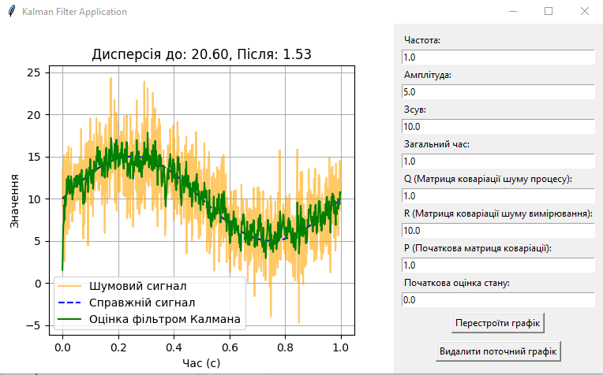
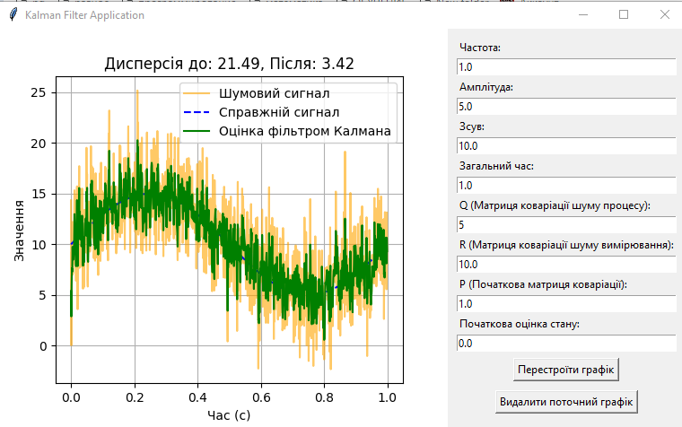
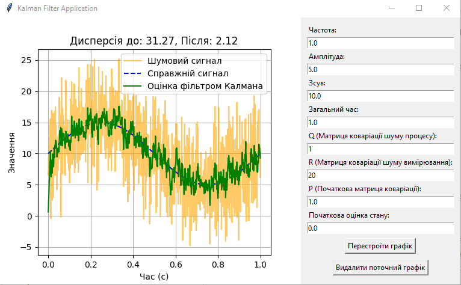
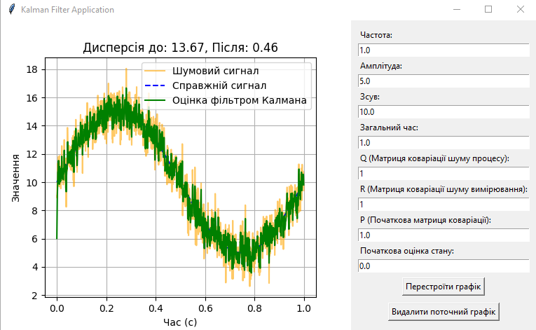
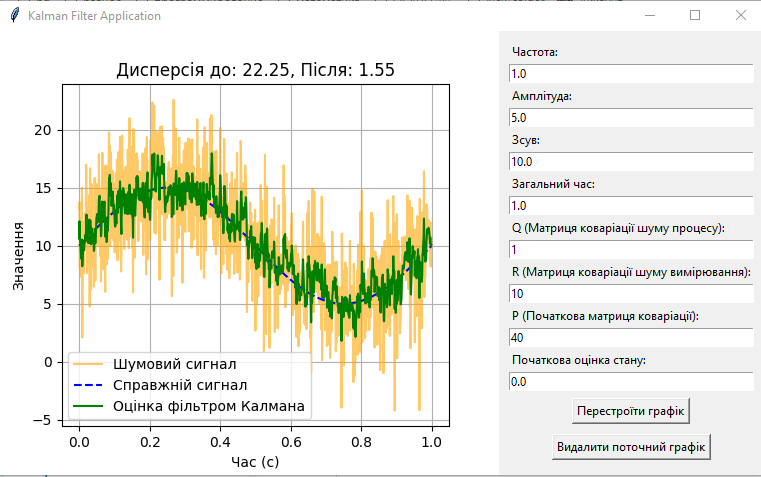

## Дослідження фільтра Калмана. Колєснік Євгеній ІПЗ-4.01

## Мета роботи

Ознайомитися з роботою фільтра Калмана та принципами його застосування, вивчити вплив різних параметрів фільтра на результати згладжування сигналу та навчитися аналізувати результати фільтрації, враховуючи значення дисперсії шуму до та після фільтрації.

## Завдання

1. Ініціалізація коду:

— Використайте код, що наданий у розділі "Теоретичні відомості", як базовий шаблон;

```python

import numpy as np
import matplotlib.pyplot as plt

class KalmanFilter:
    def __init__(self, F, H, Q, R, P, x):
        self.F = F  # State transition matrix
        self.H = H  # Measurement matrix
        self.Q = Q  # Process noise covariance
        self.R = R  # Measurement noise covariance
        self.P = P  # Initial estimation error covariance
        self.x = x  # Initial state

    def predict(self):
        # Predict the state and error covariance
        self.x = np.dot(self.F, self.x)
        self.P = np.dot(self.F, np.dot(self.P, self.F.T)) + self.Q
        return self.x

    def update(self, z):
        # Calculate Kalman Gain
        K = np.dot(self.P, self.H.T) / (np.dot(self.H, np.dot(self.P, self.H.T)) + self.R)

        # Update the estimate via measurement z
        self.x = self.x + K * (z - np.dot(self.H, self.x))

        # Update the error covariance
        self.P = (np.eye(len(self.P)) - K * self.H) @ self.P

        return self.x

# === Signal Parameters ===
frequency = 1  # Frequency of the sine wave in Hz
amplitude = 5  # Amplitude of the sine wave
offset = 10  # Offset of the sine wave
sampling_interval = 0.001  # Sampling interval in seconds (1 ms)
total_time = 1  # Total duration in seconds (1 second)

# === Noise Parameters ===
noise_variance = 16  # Variance of the Gaussian noise
noise_std_dev = np.sqrt(noise_variance)  # Calculate the standard deviation from the variance

# === Filter Parameters ===
F = np.array([[1]])  # State transition matrix
H = np.array([[1]])  # Measurement matrix

Q = np.array([[1]])  # Process noise covariance
R = np.array([[10]])  # Measurement noise covariance

P = np.array([[1]])  # Initial estimation error covariance
x = np.array([[0]])  # Initial state estimate

# Create Kalman filter instance
kf = KalmanFilter(F, H, Q, R, P, x)

# === Signal Generation ===
time_steps = np.arange(0, total_time, sampling_interval)  # Generate time steps from 0 to total_time with step size of sampling_interval
true_signal = offset + amplitude * np.sin(2 * np.pi * frequency * time_steps)  # Generate sine wave based on parameters
noisy_signal = [val + np.random.normal(0, noise_std_dev) for val in true_signal]  # Add Gaussian noise with calculated standard deviation

# === Apply Kalman Filter ===
kalman_estimates = []

for measurement in noisy_signal:
    kf.predict()  # Predict next state
    estimate = kf.update(measurement)  # Update with noisy measurement
    kalman_estimates.append(estimate[0][0])  # Store the filtered result

# === Calculate Variance Before and After Filtering ===
noise_variance_before = np.var(noisy_signal - true_signal)  # Variance of noise in the original signal
noise_variance_after = np.var(kalman_estimates - true_signal)  # Variance of noise after Kalman filtering

# Display variances
print(f"Noise Variance Before Filtering: {noise_variance_before:.2f}")
print(f"Noise Variance After Filtering: {noise_variance_after:.2f}")

# === Plot the Results ===
plt.figure(figsize=(12, 6))
plt.plot(time_steps, noisy_signal, label='Noisy Signal', color='orange', linestyle='-', alpha=0.6)
plt.plot(time_steps, true_signal, label='True Signal (Sine Wave)', linestyle='--', color='blue')
plt.plot(time_steps, kalman_estimates, label='Kalman Filter Estimate', color='green')
plt.xlabel('Time (s)')
plt.ylabel('Value')
plt.title('Kalman Filter Applied to a Noisy Sinusoidal Wave')
plt.legend()
plt.grid()
plt.show()

```

— Переконайтеся, що всі параметри фільтра Калмана (F, H, Q, R, P, x) задані правильно та відповідають початковому варіанту.


2. Дослідження впливу параметрів. Послідовно змінюйте значення кожного з наступних параметрів фільтра Калмана:

**Матриця коваріації шуму процесу** (Q) - збільшуйте та зменшуйте значення, аналізуйте, як це впливає на передбачення;
**Матриця коваріації шуму вимірювання** (R) - змініть цей параметр, щоб побачити, як фільтр реагує на зміну довіри до вимірювань;
**Початкова матриця коваріації** (P) - експериментуйте з різними початковими невпевненостями щодо стану;
**Початкова оцінка стану** (Initial state estimate) - спробуйте різні початкові значення та простежте, як це впливає на збіжність фільтра;
**Постійна складова сигналу** (offset) - змініть зсув сигналу, щоб оцінити, наскільки фільтр адаптується до зміщеного сигналу;
**Загальний час моделювання** (total_time) - для фільтрацій із дуже інерційними параметрами, змініть загальний час симуляції, щоб переконатися, що фільтр встигає "налаштуватися" та стабілізувати свої результати.

3. Порівняння результатів. Для кожної комбінації параметрів:

- Розрахуйте дисперсію шуму до фільтрації та після фільтрації;
- Створіть графік, що показує результати фільтрації у порівнянні з реальним сигналом та шумним сигналом;
- Зробіть скріншоти кожного графіка та додайте їх у звіт.

4. Аналіз та висновки:

- Зафіксуйте значення дисперсії шуму до і після фільтрації.;
- Для кожного випадку фільтрації прокоментуйте результати;
- Поясніть, як зміна конкретного параметра вплинула на передбачення, корекцію стану та зміну дисперсії;
- Сформулюйте загальні висновки щодо поведінки фільтра Калмана при різних комбінаціях параметрів.

## Технології

Для реалізації проєкту з використання фільтра Калмана на `Python` були обрані бібліотеки `Matplotlib` для візуалізації даних, що дозволяє демонструвати справжній сигнал, шумовий сигнал та оцінки фільтра, `NumPy` для наукових обчислень, включаючи роботу з матрицями, що підвищує продуктивність і точність обчислень, а також `Tkinter` для створення графічного інтерфейсу, що забезпечує зручність взаємодії з графіками та налаштуваннями фільтра в реальному часі.

## Фільтр Калмана

У файлі `src/KalmanFilter.py` був створений клас `KalmanFilter`. клас `KalmanFilter` реалізує алгоритм фільтра Калмана, який дозволяє оцінювати стан системи на основі шумових даних. Його методи відповідають за:

**predict** - Виконує передбачення нового стану та оновлює оцінку стану `x` і матрицю коваріації помилки `P`.

**update** - Оновлює оцінку стану на основі нового вимірювання `z`.

Його атрибути:

**F** - Матриця переходу стану, що описує, як стан змінюється між моментами часу;
**H** - Матриця спостереження, яка пов’язує стан із вимірюваннями.
**Q** - Коваріаційна матриця процесного шуму, яка враховує невизначеність змін стану;
**R** - Коваріаційна матриця шуму вимірювання, яка представляє невизначеність вимірювань;
**P** - Коваріаційна матриця початкової оцінки стану, яка показує, наскільки ми впевнені в поточному стані;
**x** - Початкова оцінка стану, що буде уточнюватись фільтром.

## Створення графіків

За створення графіку по заданим параметрам відповідає файл `src/main.py` Він використовує для цього бібліотеку Tkinter. 

## Перевірка

Запустимо проєкт, перевіримо працю будування графіку, зміни параметрів та вирахування дисперсії: 

> python src/main.py

Результат:



З результатів виконання видно, що відкрилось вікно з побудованим графіком та панель з параметрами побудови. У заголовку графіку відображені значення дисперсії до та після фільтрації.

Проаналізуємо графік при зміні матриці коваріації шуму процесу, яка показує, наскільки сильно очікується відхилення передбаченого стану через випадкові зміни. Збільшимо значення:



Це вказує фільтру, що процес є більш шумним і мінливим, фільтр довіряє значенням більше, ніж передбаченням. Дисперсія зростає до 3,42. Початковий графік є стабільним, а вплив шуму значний, необхідно використовувати менші значення Q для зменшення дисперсії.

Проаналізуємо графік при зміні матриці коваріації шуму вимірювання, яка визначає точність вимірювань. Збільшимо значення до 20, тим зменшуючи довіру до сенсорів:



 Це призвело до збільшення дисперсії до 2,12 та зрозтанню амплітуди графіку.

Збільшимо довіру до сенсорів, зменшимо R до 1:



Графік став наближеним до початкового сигналу. Через збільшення довіри до сенсорів значення дисперсії впало до `0.46`.

Проаналізуємо графік при зміні початкової матриці коваріації, збільшимо значення початкової невпевненості у стані до 40:



Фільтр сприймає початковий стан як менш точний та більше коригується на початкових етапах. Початок графіку вже менш схожий за оригінальний сигнал.

## Висновок

Виконуючи цю роботу я підтвердив теоретичний матеріал по дослідженню фільтру Калмана. Під час виконання роботи я ознайомився з роботою фільтра Калмана та принципами його застосування, вивчив вплив різних параметрів фільтра на результати згладжування сигналу та навчився аналізувати результати фільтрації, враховуючи значення дисперсії шуму до та після фільтрації. Фільтр Калмана є важливим інструментом для оцінювання стану систем у присутності шумів, зокрема в робототехніці, навігації та обробці сигналів. Він поєднує вимірювання з різних джерел, зменшуючи вплив шуму та дозволяючи отримувати точніші оцінки стану, що робить його незамінним у сучасних технологіях автоматизації та контролю. Отриманні знання є основою при розробці  систем пов'язаних з роботою з координатами.